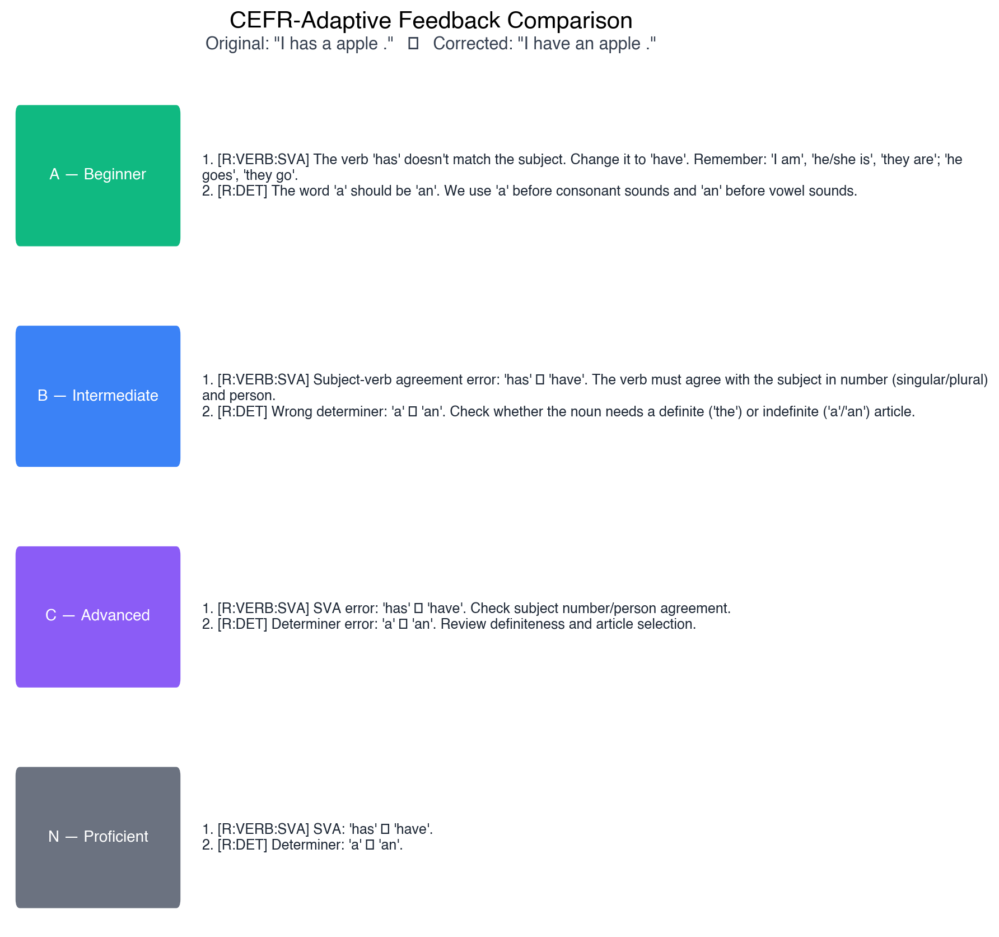
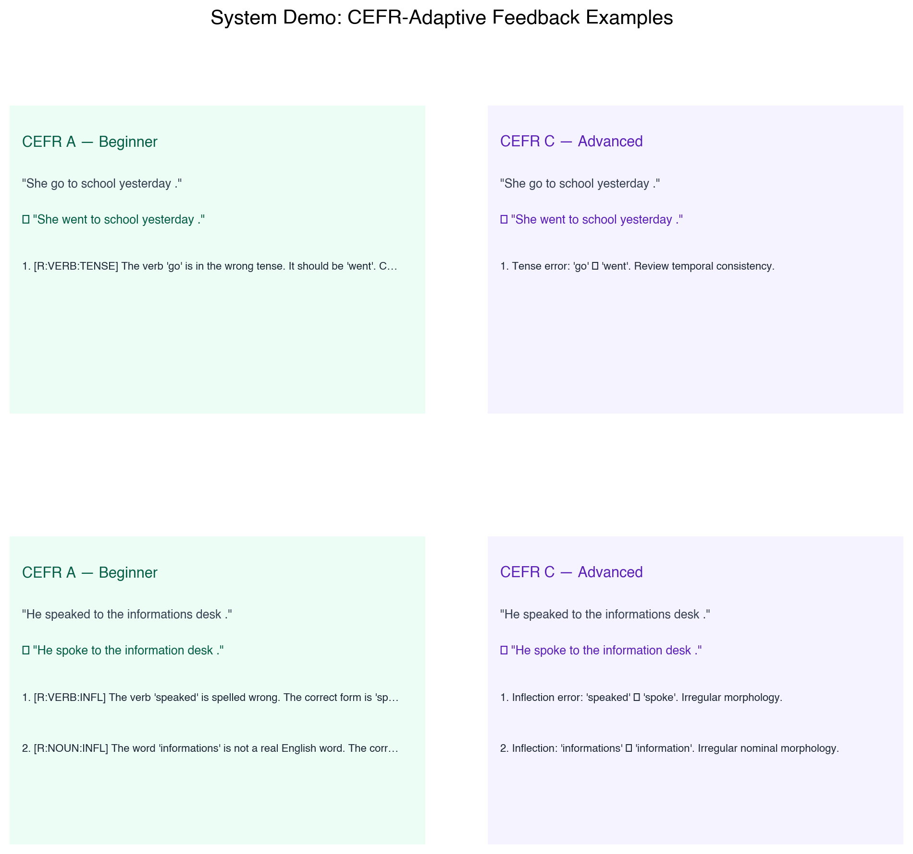

# 5. System Design

## 5.1 Architecture Overview

The system follows a modular pipeline architecture organised around five processing layers: data ingestion, correction, selection, feedback, and demonstration. Each layer is implemented as one or more standalone Python modules under a one-file-per-concern convention — that is, a single script is responsible for exactly one stage of processing — with all configuration centralised in `config.py`. Data flows through the pipeline as JSONL records (the plain-text, one-JSON-object-per-line format introduced in Section 3), ensuring that every intermediate stage produces a human-readable, version-controllable artefact that can be independently inspected or re-processed. Figure 5.1 illustrates the end-to-end data flow from raw learner text to CEFR-adaptive feedback output.

The architecture was designed with three constraints in mind. First, reproducibility: a fixed random seed (42) is propagated to every stochastic component, and all library versions are pinned in `requirements.txt`. Second, modularity: the correction engines, selector, and feedback generator are decoupled so that any engine can be added, removed, or replaced without modifying downstream components. Third, inspectability: structured logging to the `logs/` directory and JSONL output at every stage allow the researcher to trace any individual sentence through the full pipeline, which is essential for debugging and for the kind of per-error-type failure analysis reported in Section 7.

## 5.2 Core Data Objects

Table 5.1 summarises the principal data objects that flow through the pipeline, their storage format, and the module responsible for producing them.

**Table 5.1. Core data objects in the pipeline.**

| Object | Format | Producer | Path |
|--------|--------|----------|------|
| Raw M2 annotations | M2 text | BEA-2019 release | `data/raw/wi+locness/m2/` |
| Normalised corpus | JSONL | `data/normalise_to_jsonl.py` | `data/processed/wi_locness.*.jsonl` |
| Sentence records | JSONL | `data/build_records.py` | `data/processed/train_records.jsonl` |
| Dev-tune / dev-eval splits | JSONL | `data/split_dev.py` | `data/processed/dev_tune.jsonl`, `dev_eval.jsonl` |
| Source–target pairs | JSONL | `data/extract_pairs.py` | `data/processed/dev_pairs.jsonl` |
| Engine predictions | JSONL | `experiments/run_*.py` | `results/*_preds.jsonl` |
| Engine precision priors | JSON | `selector/compute_priors.py` | `results/engine_priors.json` |
| Hybrid predictions | JSONL | `selector/hybrid_selector.py` | `results/hybrid_*_preds.jsonl` |
| Evaluation metrics | JSON | `eval/evaluate_hybrid.py` | `results/eval_summary.json` |
| Feedback output | JSONL / text | `feedback/feedback_gen.py` | Runtime (Streamlit) |

## 5.3 Correction Layer

The correction layer comprises three engine wrappers, each exposing an identical interface: a `correct(sentence: str)` method returning a dictionary with `engine`, `corrected`, and `edit_ratio` fields, and a `batch_correct(sentences: list)` method with progress logging.

**LanguageTool wrapper** (`models/lt_wrapper.py`). Initialises a LanguageTool instance via language-tool-python with the en-US locale. Each sentence is processed independently through LanguageTool's `correct()` method, which applies all matching pattern rules. A try/except block catches per-sentence failures and falls back to returning the original string, ensuring batch robustness. The wrapper is stateful (the Java LanguageTool server runs as a background process) and provides a `close()` method for clean shutdown.

**T5-small tagger wrapper** (`models/tagger_wrapper.py`). Loads the Hugging Face t5-small checkpoint and prepends the prompt "Fix grammar: " to each input sentence. Generation uses beam search with two beams and a maximum sequence length of 256 tokens. The model runs on CPU in evaluation mode with gradient computation disabled. This wrapper is stateless after initialisation.

**LoRA flan-t5-base wrapper** (`models/lora_wrapper.py`). Loads the google/flan-t5-base base model and applies the Low-Rank Adaptation adapter (Hu et al., 2022) from `models/lora_flan_t5_base/adapter/` using the PEFT (Parameter-Efficient Fine-Tuning) library's `PeftModel.from_pretrained` routine. The input prefix is "Fix grammatical errors: " and generation uses four beams. The adapter files — `adapter_model.safetensors`, `adapter_config.json`, and tokeniser files — total 1.8 MB, a small fraction of the ~990 MB required for the full flan-t5-base checkpoint and a concrete illustration of the parameter efficiency of the LoRA approach.

## 5.4 Selection Layer

**Prior computation** (`selector/compute_priors.py`). For each engine, the module loads the engine's dev-tune predictions, matches them to gold-standard pairs by source text, runs the ERRANT toolkit (Bryant, Felice and Briscoe, 2017) to extract predicted and reference edits, and computes per-error-type precision as TP / (TP + FP), where TP (true positives) is the count of engine edits that align with a gold correction and FP (false positives) is the count that do not. The resulting prior table is a nested dictionary mapping engine names to per-error-type precision values, serialised to `results/engine_priors.json`. On the dev-tune partition, 3,022 of 3,500 predictions matched gold pairs; the 478 unmatched cases arise from residual essay-level versus sentence-level alignment differences that spaCy's sentenciser could not fully reconcile.

**Hybrid selector** (`selector/hybrid_selector.py`). Implements the constrained edit-level selection algorithm described in Section 4.3. The module loads all engine predictions and the prior table, then iterates over sentences. For each sentence, it extracts ERRANT edits from every engine's correction, scores each edit by its engine's prior for that error type, filters by a minimum precision threshold of 0.10, and greedily selects non-overlapping edits in descending score order. Selected edits are applied right-to-left to produce the hybrid output. The module logs engine contribution statistics, CEFR-level breakdowns, and overall edit counts.

## 5.5 Feedback Layer

**Templates** (`feedback/templates.py`). Stores CEFR-adaptive feedback strings for 30 ERRANT error types across the four proficiency levels (A, B, C, N) described in Section 4.5. Templates use Python format-string placeholders — `{original}` and `{corrected}` — into which the specific tokens involved in each edit are substituted at runtime, and are grounded in the corrective feedback typology of Ellis (2009). A `get_feedback()` function performs hierarchical fallback: first an exact error-type match, then a prefix-based fallback (for example, R:OTHER is used for any unrecognised R:-prefixed replacement), and finally a generic template if no more specific match is available.

**Feedback generator** (`feedback/feedback_gen.py`). The `generate_feedback()` function takes an original sentence, a corrected sentence, and a CEFR level, extracts ERRANT edits between them, and looks up the appropriate template for each edit. It returns a `FeedbackResult` dataclass containing per-edit `FeedbackItem` objects and a formatted `summary` property. A `generate_feedback_batch()` function processes lists of prediction records with progress logging. The module also supports serialisation to dictionary format for JSONL output.

## 5.6 Demonstrator

The demonstrator (`app/demo.py`) provides an interactive web interface for the full pipeline, built on Streamlit — an open-source Python framework that renders script variables as live web components without requiring any separate front-end code. Users enter text, select a CEFR level, and choose a correction mode (Hybrid, LanguageTool-only, or LoRA-only). The interface displays a word-level diff of the correction (a side-by-side visualisation that highlights insertions, deletions, and substitutions relative to the original sentence), per-error feedback cards colour-coded by CEFR level, aggregate metrics (error count, engine contributions, processing time), and optional panels for raw ERRANT edits and cross-CEFR comparison. Engine instances are cached via Streamlit's `@st.cache_resource` decorator to avoid reloading models on each interaction. Crucially, the demonstrator imports directly from the correction, selection, and feedback modules and therefore exercises exactly the same code paths as the batch evaluation pipeline, guaranteeing behavioural equivalence between the interactive and experimental settings.

**Figure 5.1.** Tool output showing the four CEFR-adaptive feedback registers (A, B, C, N) for a single correction. The same underlying edit is re-rendered by the feedback layer with increasing metalinguistic depth as proficiency rises, illustrating the scaffolded-feedback principle operationalised in Section 4.5.

**Figure 5.2.** Tool output for two distinct learner sentences, with the CEFR-adaptive feedback module producing different explanations at Level A (direct correction with a plain-language rule) and Level B (metalinguistic annotation with grammatical terminology).

## 5.7 Logging and Reproducibility Infrastructure

All modules write structured logs to `logs/` via Python's `logging` module, including timestamps, module identity, and key parameter values. The centralised `config.py` defines all directory paths as `pathlib.Path` objects and provides an `ensure_dirs()` function that creates the full directory tree on first run. Evaluation outputs are saved as JSON to `results/eval_summary.json` and `results/eval_by_type.json`, and publication-ready figures are generated by `app/generate_screenshots.py` to `results/plots/`.

## References

Bryant, C., Felice, M. and Briscoe, T. (2017) 'Automatic annotation and evaluation of error types for grammatical error correction', in *Proceedings of the 55th Annual Meeting of the Association for Computational Linguistics (Volume 1: Long Papers)*. Vancouver: Association for Computational Linguistics, pp. 793–805.

Ellis, R. (2009) 'A typology of written corrective feedback types', *ELT Journal*, 63(2), pp. 97–107.

Hu, E.J. et al. (2022) 'LoRA: Low-Rank Adaptation of Large Language Models', in *Proceedings of the Tenth International Conference on Learning Representations*. Virtual: OpenReview.net.
