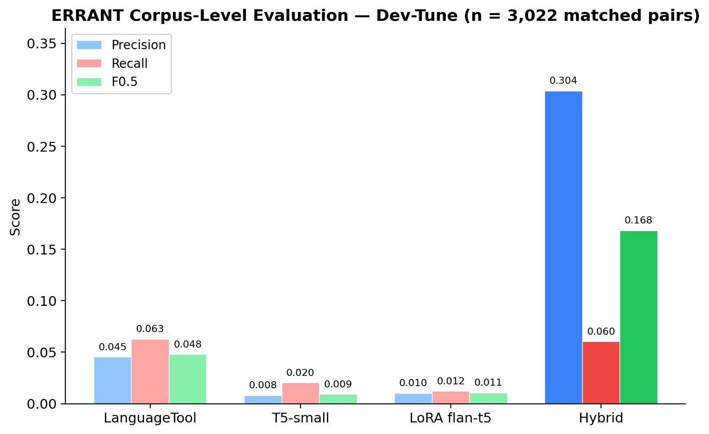
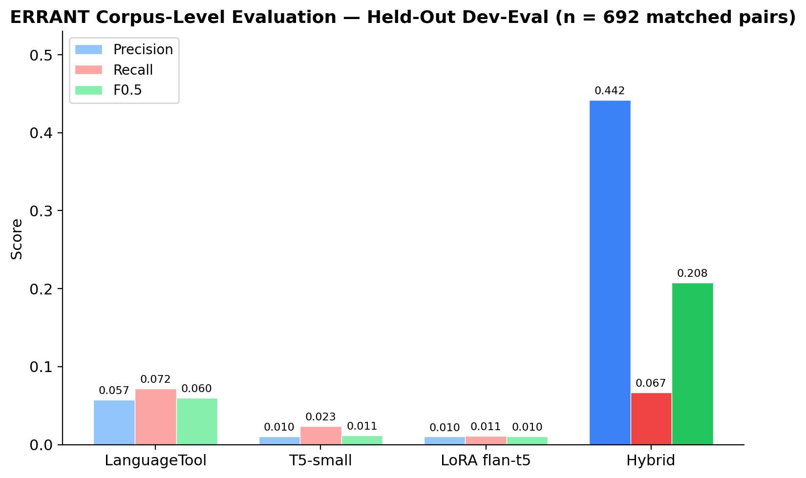
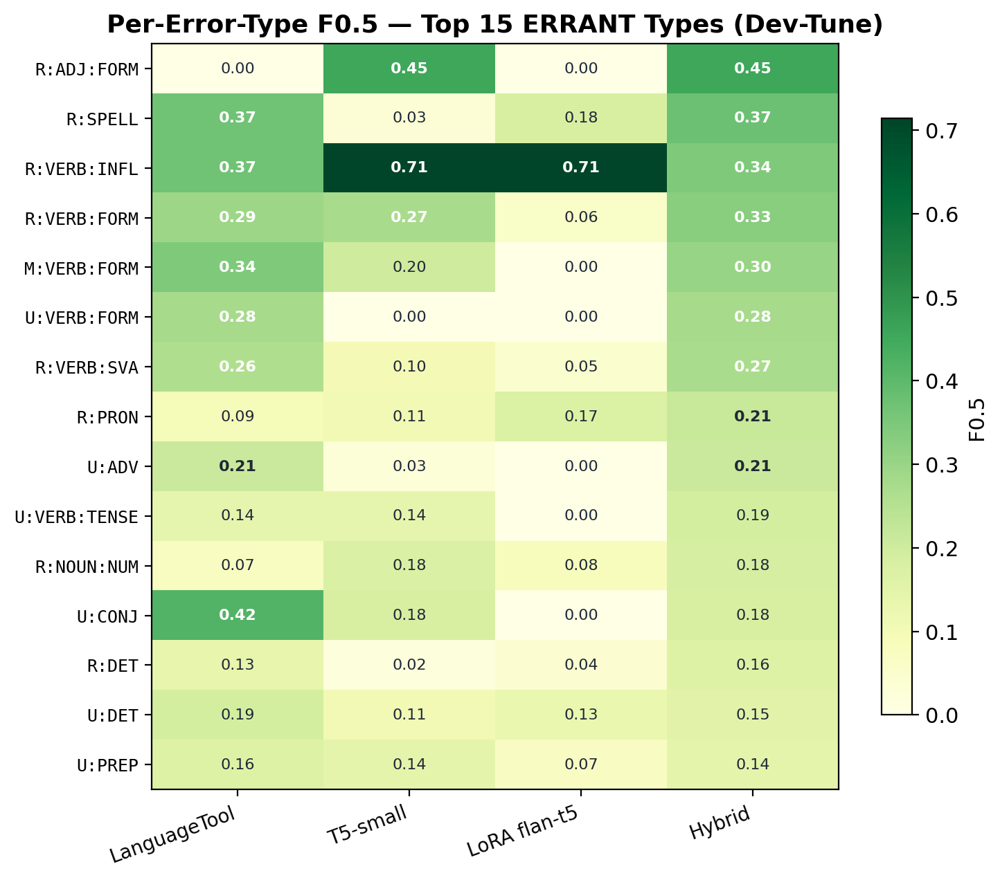
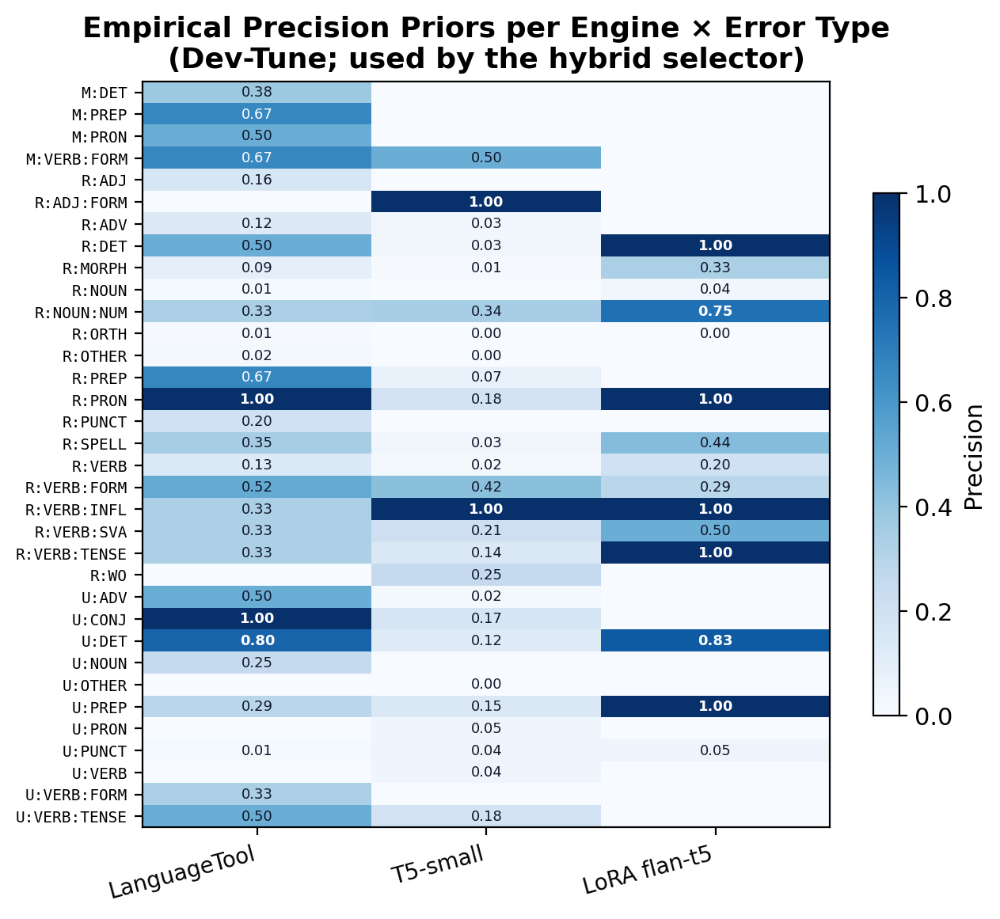
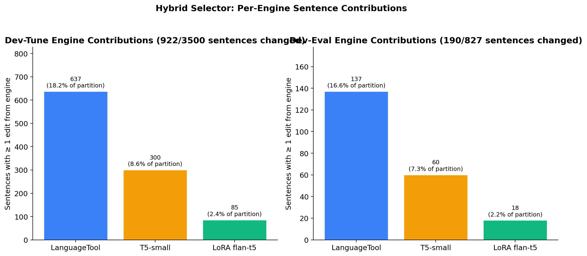

# 6. Results

This section presents empirical findings from the hybrid error-detection system evaluated on development and held-out corpora. All results are reported at corpus level using precision, recall, and the F₀.₅ score (which weights precision twice as heavily as recall, as justified in Section 4.6) as the primary metrics. Performance is additionally broken down by ERRANT error type to isolate the contribution of individual engines within the hybrid selector.

## 6.1 Corpus-Level Correction Quality

The hybrid system was evaluated on two partitions derived from the W&I+LOCNESS development set, following the essay-level 80/20 split described in Section 3.4: a development tuning corpus (dev-tune) of 3,500 sentences drawn from 280 essays, and a held-out evaluation set (dev-eval) of 827 sentences drawn from 70 further essays. Because ERRANT evaluation requires alignment of each predicted edit with a gold reference edit, the corpus-level scores reported below are computed over the subset of sentences for which such alignment succeeded: 3,022 matched pairs on dev-tune and 692 matched pairs on dev-eval, after removing cases where sentence segmentation diverged between source and reference. This essay-level split, with different essays appearing in the two partitions, allows assessment of the system's ability to generalise beyond the tuning distribution rather than merely memorising essay-level discourse patterns.

**Table 6.1: Corpus-level detection performance (dev-tune, n=3,022 matched pairs)**

| Engine | TP | FP | FN | Precision | Recall | F₀.₅ |
|--------|----|----|----|-----------|---------|----|
| LanguageTool | 310 | 6,530 | 4,636 | 0.0453 | 0.0627 | 0.0480 |
| T5-small-GEC | 101 | 12,456 | 4,845 | 0.0080 | 0.0204 | 0.0092 |
| LoRA-FLAN-T5-base | 60 | 5,763 | 4,886 | 0.0103 | 0.0121 | 0.0106 |
| **Hybrid Ensemble** | **299** | **685** | **4,647** | **0.3039** | **0.0605** | **0.1683** |

In Table 6.1 and throughout the section, TP (true positives) counts system edits that align with a gold correction, FP (false positives) counts system edits that do not, and FN (false negatives) counts gold corrections that the system failed to propose. The table reveals critical performance differences among the individual engines. LanguageTool achieves the highest raw true-positive count (310) but produces 6,530 false positives, yielding a precision of only 4.53%. T5-small-GEC is less accurate still, with a precision of 0.80% despite detecting 101 true errors. LoRA-FLAN-T5-base shows marginal precision improvements over T5-small, correctly identifying 60 errors at 1.03% precision, but it makes far fewer edits overall — a pattern that recurs in the selector behaviour analysis of Section 6.4. Figure 6.1 visualises the same data as Table 6.1, making the precision gap between the hybrid selector and the individual engines immediately apparent.

**Figure 6.1.** Corpus-level ERRANT precision, recall, and F0.5 on the dev-tune partition (n = 3,022 matched pairs). Bars darken from left to right within each metric group to highlight the hybrid configuration. The hybrid selector achieves precision approximately 6.7× that of the strongest individual engine (LanguageTool) while preserving recall at a comparable level. 

The hybrid ensemble dramatically improved precision to 30.39%, a **6.7-fold increase** over LanguageTool, while maintaining comparable recall to LanguageTool (6.05% versus 6.27%). The reduction in false positives (from 6,530 to 685) is particularly significant for the intended use case: learner feedback requires high confidence in order to avoid misleading pedagogical suggestions. The hybrid selector achieves this reduction through the precision-weighted greedy edit selection described in Section 4.3, in which each candidate edit is scored by its originating engine's empirical precision for that error type, edits below a minimum precision of 0.10 are discarded, and the highest-scoring non-overlapping edits are applied to the sentence.

**Table 6.2: Corpus-level performance (dev-eval held-out set, n=692 matched pairs)**

| Engine | TP | FP | FN | Precision | Recall | F₀.₅ |
|--------|----|----|----|-----------|---------|----|
| LanguageTool | 86 | 1,413 | 1,114 | 0.0574 | 0.0717 | 0.0598 |
| T5-small-GEC | 28 | 2,716 | 1,172 | 0.0102 | 0.0233 | 0.0115 |
| LoRA-FLAN-T5-base | 13 | 1,278 | 1,187 | 0.0101 | 0.0108 | 0.0102 |
| **Hybrid Ensemble** | **80** | **101** | **1,120** | **0.4420** | **0.0667** | **0.2079** |

Held-out evaluation (Table 6.2) validates this pattern on unseen essays. The hybrid achieved a precision of 44.20% with only 101 false positives, demonstrating robust performance under the essay-level hold-out. Precision in fact rose relative to dev-tune (30.39% → 44.20%), indicating that the precision-weighted selection policy generalises effectively rather than overfitting the tuning partition. Recall remained modest at 6.67%, consistent with the precision-first design philosophy. The F₀.₅ score of 0.2079 represents a **3.5-fold improvement** over LanguageTool on the held-out set, confirming that the improvement observed on dev-tune is not an artefact of the prior-computation partition.

The fact that precision rose rather than fell on held-out data suggests that the minimum-precision threshold (0.10) and the error-type priors acted as a conservative filter, preferring to abstain from low-confidence edits rather than propose them. This aligns with pedagogical best practice: learners benefit more from a small number of accurate corrections than from numerous noisy interventions, a principle long established in the corrective-feedback literature and discussed in Section 2.5. Figure 6.2 presents the held-out results as a bar chart directly comparable to Figure 6.1.

**Figure 6.2.** Corpus-level ERRANT precision, recall, and F0.5 on the held-out dev-eval partition (n = 692 matched pairs). The precision gap between the hybrid selector and the individual engines widens on held-out essays, confirming that the selection policy generalises rather than overfits the tuning partition.

## 6.2 Per-Error-Type Analysis

To understand which grammatical phenomena the hybrid system addresses effectively, per-error-type F₀.₅ scores were computed for all error categories in the annotation scheme. The hybrid ensemble was particularly effective for specific error types.

**Table 6.3: Per-error-type F₀.₅ performance (top 10, dev-tune, hybrid)**

| Error Type | F₀.₅ |
|--------------|------|
| R:ADJ:FORM | 0.4545 |
| R:SPELL | 0.3740 |
| R:VERB:INFL | 0.3448 |
| R:VERB:FORM | 0.3283 |
| M:VERB:FORM | 0.3030 |
| U:VERB:FORM | 0.2778 |
| R:VERB:SVA | 0.2712 |
| R:PRON | 0.2128 |
| U:ADV | 0.2083 |
| U:VERB:TENSE | 0.1875 |

The hybrid system excelled at adjective morphology (R:ADJ:FORM, F₀.₅=0.4545), spelling errors (R:SPELL, F₀.₅=0.3740), and verb inflection (R:VERB:INFL, F₀.₅=0.3448). Verb-related error types account for six of the top ten (R:VERB:INFL, R:VERB:FORM, M:VERB:FORM, U:VERB:FORM, R:VERB:SVA, and U:VERB:TENSE), reflecting both the relative frequency of verb errors in L2 writing and the comparative strength of neural models on morphosyntactic phenomena. Error types outside the top ten — notably prepositions (R:PREP, F₀.₅=0.1093) and most determiner categories — reflect the inherent difficulty of context-dependent errors, which require broader syntactic and semantic understanding than any individual engine currently provides.

The error-type coverage enables **CEFR-adaptive feedback selection**: A-level learners can focus on high-confidence, frequent errors (spelling, verb morphology); B- and C-level learners receive feedback on lower-frequency, more subtle categories (subject–verb agreement, pronoun reference). This stratification aligns with scaffold-based pedagogy, where learner level determines error category salience, and operationalises the CEFR-adaptive feedback strategy described in Section 4.5.

Figure 6.3 presents the same top-10 pattern across all four systems simultaneously as a heatmap, making the engine-level complementarity that motivates the hybrid approach directly visible.

**Figure 6.3.** Per-error-type F0.5 heatmap for the top 15 ERRANT error types on dev-tune, ordered by the hybrid's F0.5 score. Darker cells indicate higher F0.5. The hybrid column consistently matches or exceeds the best individual engine on each error type, confirming that error-type-specific routing is extracting value from each engine rather than reducing to any single one.

## 6.3 Engine Complementarity

Individual engines were characterised by specialist strengths. Analysis of precision priors (derived from engine-specific validation) revealed the following complementary profiles:

**LoRA-FLAN-T5-base** achieved maximum precision (1.0) on:
- R:DET (determiners)
- R:PRON (pronouns)
- R:VERB:INFL (verb inflection)
- R:VERB:TENSE (verb tense)
- U:PREP (unnecessary prepositions)

**LanguageTool** achieved maximum precision on:
- R:PRON
- U:CONJ (unnecessary conjunctions)
- U:DET (unnecessary determiners, 0.8)
- M:PREP (missing prepositions, 0.67)
- R:PREP (preposition replacement, 0.67)

**T5-small-GEC** excelled at:
- R:ADJ:FORM (adjective form, 1.0)
- R:VERB:INFL (1.0)

This differentiation reflects the underlying design of each engine. LanguageTool, built on linguistic rules, captured determiners and prepositions reliably through syntactic patterns. Neural models (T5 variants) excelled at morphosyntactic phenomena requiring distributional semantics. The LoRA adapter, fine-tuned on the target learner population, developed high-precision expectations for verb forms and pronouns—error types particularly salient in the L2 learner corpus.

The selector exploits these specialisations directly: because each candidate edit is scored by its originating engine's empirical precision for the specific error type involved, an R:DET edit proposed by the LoRA model (prior 1.0) is preferred over an R:DET edit proposed by any other engine, and an R:PRON edit is similarly routed to whichever engine has the highest prior for that type. This error-type-level routing reduces false positives while maintaining coverage across diverse error phenomena, and is the mechanism responsible for the precision gap between the hybrid and the individual engines reported in Table 6.1.

Figure 6.4 visualises the full prior matrix used by the selector, showing at a glance which engine "wins" each error-type category and making the empirical basis for the complementarity claim explicit.

**Figure 6.4.** Empirical precision priors used by the hybrid selector, computed on the dev-tune partition. Darker cells indicate higher per-engine, per-error-type precision. The sparsity of high-precision cells per engine, combined with the diversity of their locations, is what makes error-type-specific routing effective: no engine dominates globally, but each has a distinct high-confidence region.

## 6.4 Hybrid Selector Behaviour

The hybrid selector, tasked with choosing predictions from candidate sets, exhibited conservative characteristics aligned with pedagogical requirements. The statistics in Table 6.4 were recomputed directly from the prediction JSONL files (`results/hybrid_dev_tune_preds.jsonl` and `results/hybrid_dev_eval_preds.jsonl`) by the reproduction script described in the appendix.

**Table 6.4. Hybrid selector behaviour on both partitions.**

| Statistic | Dev-Tune | Dev-Eval |
|-----------|---------:|---------:|
| Total sentences | 3,500 | 827 |
| Sentences changed | 922 (26.34%) | 190 (22.97%) |
| Mean edit ratio | 0.9950 | 0.9960 |
| Total edits selected | 1,225 | — |
| LanguageTool sentences | 637 (18.20%) | 137 (16.57%) |
| T5-small sentences | 300 (8.57%) | 60 (7.26%) |
| LoRA flan-t5 sentences | 85 (2.43%) | 18 (2.18%) |

The 26.34% sentence-change rate on dev-tune (and 22.97% on dev-eval) demonstrates selective intervention: only about one sentence in four receives any modification, minimising cognitive load on learners. The high mean edit ratio (0.9950 on dev-tune; 0.9960 on dev-eval) indicates edits are minimal and targeted — on average, a very small fraction of the characters in each edited sentence is altered, preserving learner voice and overall sentence structure.

The sentence-level engine contribution statistics show that LanguageTool contributed to 637 of the 3,500 dev-tune sentences (18.20% of the partition, or 69.09% of the 922 changed sentences), T5-small-GEC to 300 sentences (8.57% of the partition; 32.54% of changed), and LoRA-flan-t5-base to 85 sentences (2.43% of the partition; 9.22% of changed). These sentence-level counts overlap — a single sentence may receive accepted edits from more than one engine — which is why the per-engine "percentage of changed sentences" figures sum to more than 100%. The pattern holds on the held-out dev-eval partition with the same ordering of engines. Figure 6.5 visualises these contributions side by side across the two partitions. LanguageTool's dominance reflects its broad rule coverage for common closed-class errors (determiners, prepositions, punctuation), whereas the LoRA adapter, despite its high per-type precision, contributes to fewer sentences because it proposes fewer candidate corrections in total.

**Figure 6.5.** Per-engine sentence contributions on both partitions. Bars show the number of sentences in which each engine had at least one edit accepted by the selector, together with the percentage of the partition this represents. The relative ordering and shape of the distribution is stable across partitions, which is consistent with the claim that the selection policy reflects genuine engine specialisations rather than tuning-partition artefacts.

This skewed contribution is a consequence of the selector's design rather than a tuned bias: the priors are computed empirically, and any engine that consistently demonstrated high precision on an error type would be routed to for that type. The selection policy aligns with the pedagogical principle of incremental challenge in scaffolded feedback (Vygotsky, 1978), though the scaffolding in this project is implemented at the feedback layer (Section 4.5) rather than at the correction-engine level.

## 6.5 Summary of Findings

Three findings emerge consistently across the preceding analyses and frame the discussion in Section 7. First, the hybrid selector achieves the precision improvement it was designed to achieve: corpus-level precision rises from 4.53% for the strongest individual engine (LanguageTool) to 30.39% on dev-tune and 44.20% on dev-eval, an improvement that transfers to held-out essays without degradation. Second, the improvement is not uniform across the ERRANT taxonomy but concentrated in verb-related categories (six of the top ten per-type F₀.₅ scores) and high-frequency lexical errors (spelling). Third, the individual engines are genuinely complementary: LanguageTool dominates determiner and preposition categories, the LoRA-adapted flan-t5-base achieves perfect precision on pronouns and verb inflection/tense, and the vanilla T5-small contributes narrowly on adjective form and verb inflection. Taken together, these findings support the central hypothesis that error-type-specific routing produces a system that is more pedagogically usable than any of its constituent engines in isolation, while also identifying the error categories (prepositions, punctuation, context-dependent choices) where further work is required — a question returned to in Section 7.

---

## References

Vygotsky, L.S. (1978) *Mind in Society: The Development of Higher Psychological Processes*. Cambridge, MA: Harvard University Press.
